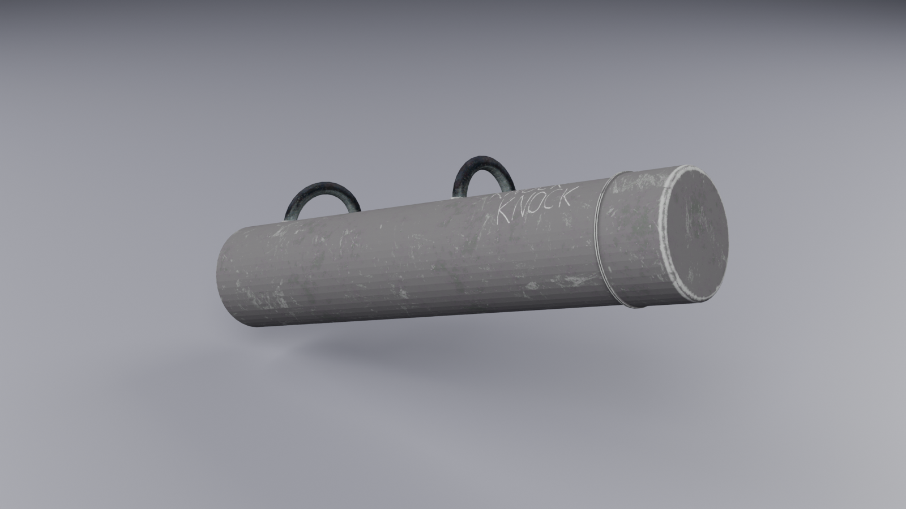
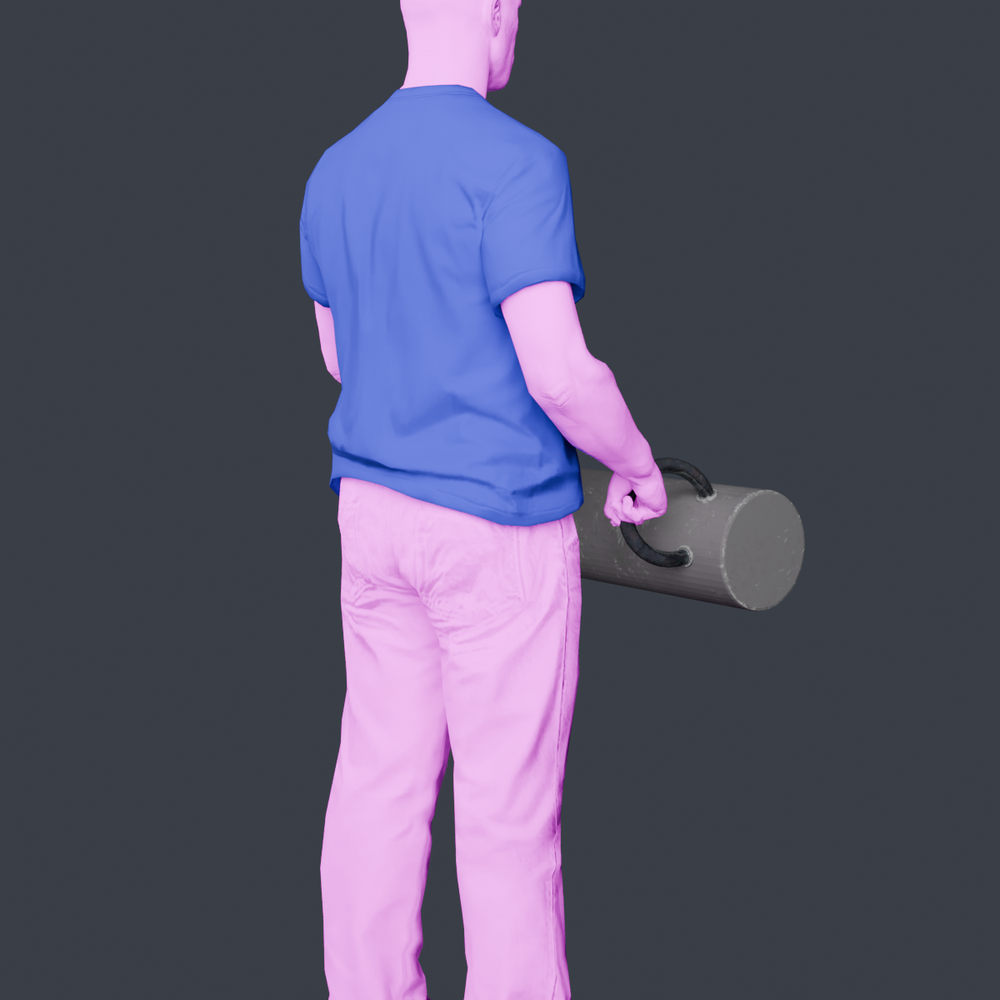
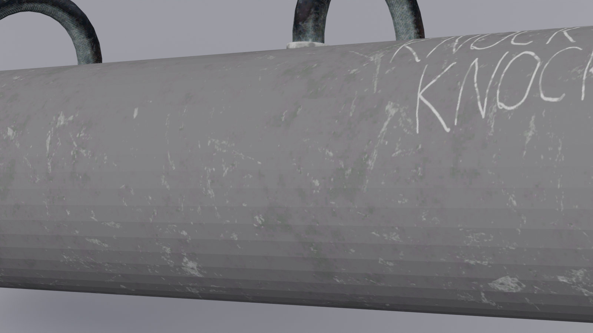

# Battering Ram

A two-handed battering ram melee weapon for **Qbox** / **ox_inventory**, with a looping breach
animation for forcing doors.



| | |
|---|---|
|  |  |

- `WEAPON_BATTERINGRAM` — two-handed melee, carried like a minigun
- `anim@batteringram` — enter / loop / exit clips for a repeated ram thrust
- 4,460 tris, 2K diffuse + 2K normal + 1K spec, **~3.2 MB total**

---

## Install

1. Drop the folder into your resources and `ensure batteringram` in `server.cfg`.
2. Add the weapon to `ox_inventory/data/weapons.lua`:

```lua
['WEAPON_BATTERINGRAM'] = {
    label = 'Battering Ram',
    weight = 15000,
    durability = 0.05,
},
```

That's it for the weapon itself. Give it out with
`/giveitem <id> WEAPON_BATTERINGRAM` or through your shop config.

---

## The breach animation

The dictionary is `anim@batteringram`, streamed from `stream/anim@batteringram.ycd`.

| clip | length | use |
|---|---|---|
| `breach_enter` | 0.42 s | carry pose → wound back, ready to swing |
| `breach_loop` | 1.00 s | wind back → strike → recoil. **Loops seamlessly.** |
| `breach_exit` | 0.42 s | back to the carry pose |

Minimal example — play the loop while a progress bar runs, then break the door:

```lua
local DICT <const> = 'anim@batteringram'

local function loadDict(dict)
    if HasAnimDictLoaded(dict) then return true end
    RequestAnimDict(dict)
    local timeout = GetGameTimer() + 5000
    while not HasAnimDictLoaded(dict) and GetGameTimer() < timeout do Wait(10) end
    return HasAnimDictLoaded(dict)
end

function PlayBreach(duration)
    if not loadDict(DICT) then return false end

    local ped = cache.ped
    TaskPlayAnim(ped, DICT, 'breach_enter', 8.0, -8.0, -1, 0, 0.0, false, false, false)
    Wait(420)
    -- flag 1 = looping
    TaskPlayAnim(ped, DICT, 'breach_loop', 8.0, -8.0, -1, 1, 0.0, false, false, false)
    Wait(duration)
    TaskPlayAnim(ped, DICT, 'breach_exit', 8.0, -8.0, -1, 0, 0.0, false, false, false)
    Wait(420)
    ClearPedTasks(ped)
    return true
end
```

`duration` should be a multiple of 1000 ms so the loop finishes on the recoil rather than
mid-strike.

### Attaching the ram as a prop

If your script hides the weapon and attaches a prop instead (common when the breach is driven by a
separate resource), the model is aligned for **bone 28422** (`PH_R_Hand`) with **no offset**:

```lua
prop = {
    model = `w_me_batteringram`,
    bone = 28422,
    pos = vec3(0.0, 0.0, 0.0),
    rot = vec3(0.0, 0.0, 0.0),
}
```

---

## How the weapon is held

The carry pose comes from Rockstar's minigun clipset, not a melee one:

```xml
<MotionClipSetHash>weapons@heavy@minigun</MotionClipSetHash>
<MotionFilterHash>BothArms_filter</MotionFilterHash>
<WeaponClipSetHash>weapons@heavy@minigun</WeaponClipSetHash>
<MeleeClipSetHash>melee@large_wpn@streamed_core</MeleeClipSetHash>
```

`BothArms_filter` is what stops the off hand hanging loose. The melee clipsets are left as the
large-two-handed set so swinging it still works as an ordinary melee weapon.

The model itself is built on **the minigun's skeleton** — all twelve of its bones, orientations
intact — with only the mesh replaced. GTA positions an equipped weapon using a transform that
isn't exposed in the rig or the metas, so matching the donor skeleton is what makes the hold
correct: the ram's ring handles sit on `Gun_GripR` / `Gun_GripL`, exactly where the minigun's
grips were, and the clipset does the rest.

If you retexture or reshape the model, keep those two bones where they are or the hands will
drift off the handles.

---

## Files

```
data/weapons.meta             WEAPON_BATTERINGRAM (MELEE, TwoHanded MeleeClub)
data/weaponanimations.meta    the minigun carry clipset
data/weaponarchetypes.meta    model + txd names
data/pedpersonality.meta      ped reactions
stream/w_me_batteringram.ydr  model, textures embedded
stream/anim@batteringram.ycd  breach_enter / breach_loop / breach_exit
cl_weaponNames.lua            registers the 'Battering Ram' label
```

Textures are embedded in the `.ydr`, so there is no separate `.ytd` to ship.

---

## Tuning the animation

The clips are authored by rotating the spine chain (`SKEL_Spine_Root` → `SKEL_Spine3`) with the
bend weighted so it increases up the chain, plus a shoulder follow — the whole upper body drives
the ram rather than the arms alone, which keeps the hands locked to the handles.

Current values: **19°** spine bend, **15°** shoulder, wound back to **−1.35** and driven forward to
**+1.0** so it loads deeper than it delivers. Hand travel is **0.575 m** over a 24-frame cycle,
with the strike landing on frame 9 — roughly a third of the loop, so it snaps forward and takes
its time reloading.

To make it heavier, raise the spine angle before shortening the loop; below about 20 frames it
starts to read as twitchy rather than forceful.

---

## Credits

Model: battering ram asset, converted and rigged for FiveM.
Weapon metadata derived from Rockstar's stock weapon definitions.
